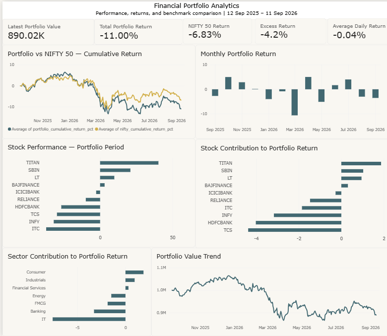
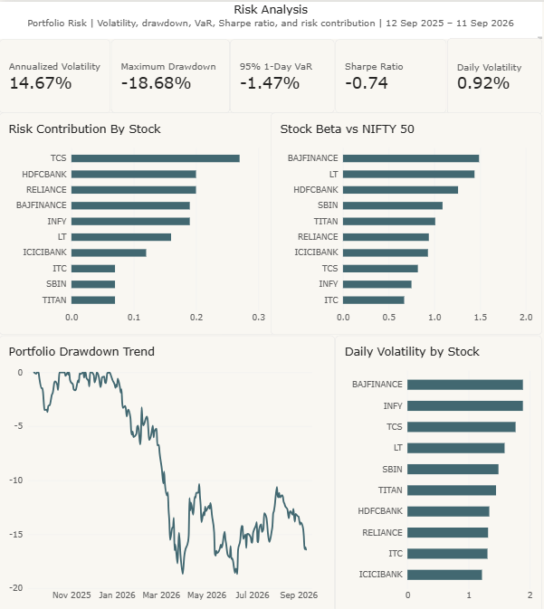
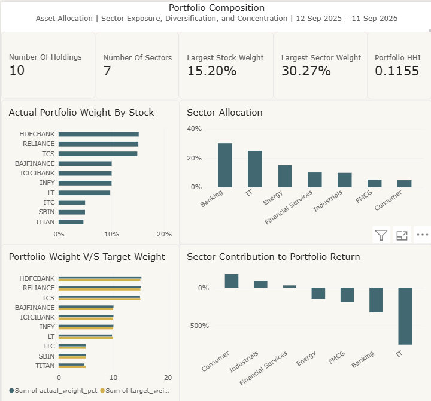
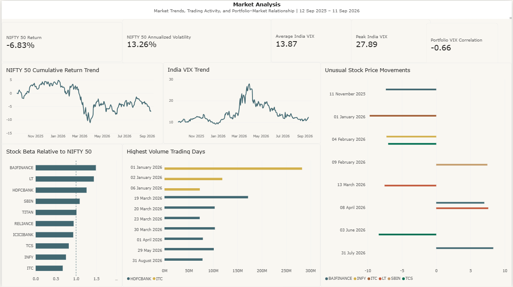

# Financial Portfolio & Risk Analytics Platform

An end-to-end data analytics project evaluating a hypothetical Indian equity portfolio across performance, risk, diversification, benchmark comparison, and market behaviour — built on historical NSE market data with a Python → PostgreSQL → Power BI pipeline.

**Keywords:** Python, Pandas, NumPy, SQL, PostgreSQL, Financial Analytics, Risk Analysis, Portfolio Management, Power BI, Business Intelligence, NSE, NIFTY 50

---

## Project Overview

This project simulates the work of a Data Analyst at an investment or wealth-management firm. It uses historical NSE market data to build and evaluate a hypothetical **₹10,00,000 portfolio of 10 Indian equities**, covering:

- Individual stock performance
- Portfolio performance and return
- Stock and sector contribution
- Volatility, drawdown, Sharpe ratio, and Value at Risk
- Portfolio concentration and diversification
- Benchmark comparison with the NIFTY 50
- Stock beta relative to the NIFTY 50
- India VIX and portfolio relationship
- Trading volume and unusual price movements
- Interactive Power BI reporting

---

## Dashboard Preview

<table>
<tr>
<td></td>
<td></td>
</tr>
<tr>
<td></td>
<td></td>
</tr>
</table>

*Full breakdown of each page in the [Power BI Dashboard](#power-bi-dashboard) section below.*

---

## Business Objective

The project answers practical investment-analytics questions such as:

- Which stocks generated the highest and lowest returns?
- Which stocks and sectors contributed most to portfolio performance?
- How did the portfolio perform over time?
- What level of volatility and drawdown did the portfolio experience?
- How concentrated or diversified was the portfolio?
- How did portfolio performance compare with the NIFTY 50?
- Which stocks had higher sensitivity to market movements?
- How did portfolio returns relate to India VIX?
- Which trading days showed unusually high volume or price movements?

---

## Portfolio

The portfolio starts with **₹10,00,000** on **12 September 2025**, allocated across 10 equities using whole-share quantities at target weights, with the remainder held as cash.

| Symbol | Sector | Target Weight |
|---|---|---|
| RELIANCE | Energy | 15% |
| HDFCBANK | Banking | 15% |
| ICICIBANK | Banking | 10% |
| SBIN | Banking | 5% |
| TCS | IT | 15% |
| INFY | IT | 10% |
| ITC | FMCG | 5% |
| LT | Industrials | 10% |
| TITAN | Consumer | 5% |
| BAJFINANCE | Financial Services | 10% |

- **Initial invested amount:** ₹9,86,343.35
- **Unused cash:** ₹13,656.65

---

## Data Sources

NSE-sourced historical market data for the 10 individual equities, the **NIFTY 50**, and **India VIX**:

- **Stock dataset:** 13 September 2021 – 11 September 2026
- **NIFTY 50 & India VIX datasets:** 12 September 2025 – 11 September 2026, matching the portfolio analysis period

> **Limitation:** The benchmark and India VIX data currently cover one year, so benchmark-relative conclusions are limited to the portfolio period rather than the full five-year stock-data period.

---

## Tech Stack

| Layer | Tools |
|---|---|
| Data Cleaning & Analysis | Python, Pandas, NumPy |
| Analytical Exploration | Jupyter |
| Relational Storage & Analytics | PostgreSQL |
| Dashboarding | Power BI |
| Version Control | Git / GitHub |

---

## Project Architecture

```
FinancePortfolioAnalytics/
│
├── data/
│   ├── raw/
│   │   ├── Stocks/
│   │   ├── NIFTY 50_Historical_PR_12092025to12092026.csv
│   │   └── hist_india_vix_-12-09-2025-to-12-09-2026.csv
│   │
│   └── processed/
│       ├── stocks/
│       ├── stocks_adjusted/
│       ├── portfolio/
│       └── corporate_actions/
│
├── notebooks/
│
├── sql/
│   ├── 01_database_setup.sql
│   ├── 02_data_loading_validation.sql
│   ├── 03_portfolio_analytics.sql
│   └── 04_powerbi_views.sql
│
├── src/
│   ├── validate_raw_data.py
│   ├── clean_raw_data.py
│   ├── adjusted_data.py
│   ├── create_portfolio.py
│   └── portfolio_performance.py
│
├── powerbi/
│
├── reports/
│
├── README.md
└── requirements.txt
```

---

## Data Pipeline

A reproducible, multi-stage pipeline:

```
NSE Historical Data
        ↓
Raw Data Validation
        ↓
Data Cleaning
        ↓
Corporate Action Adjustment
        ↓
Portfolio Construction
        ↓
Portfolio Valuation & Performance
        ↓
PostgreSQL Data Warehouse
        ↓
Analytical SQL
        ↓
Power BI Views
        ↓
Power BI Dashboard
```

### 1. Raw Data Validation
Checks row counts, column structure, data types, date ranges, missing values, duplicate records, invalid prices/volumes, and unexpected values.

### 2. Data Cleaning
Standardizes column names, strips formatting characters from numeric fields, converts numeric fields to appropriate types, parses trading dates, filters equity (EQ) series, removes duplicate symbol/date records, sorts chronologically, calculates daily returns, validates OHLC relationships, and flags (rather than deletes) extreme daily returns for investigation.

### 3. Corporate Action Handling
Corporate actions can create artificial price jumps if raw prices are compared directly across split/bonus dates. The project preserves the original raw data and creates **adjusted** historical prices for return and risk analysis, applying adjustment factors to pre-ex-date prices.

| Symbol | Ex-Date | Action | Adjustment Factor |
|---|---|---|---|
| BAJFINANCE | 16 Jun 2025 | Split + Bonus | 10 |
| RELIANCE | 28 Oct 2024 | 1:1 Bonus | 2 |
| HDFCBANK | 26 Aug 2025 | 1:1 Bonus | 2 |

---

## Data Warehouse / Data Model

**PostgreSQL tables:**
- `companies`
- `prices`
- `price_import`
- `benchmarks` → NIFTY 50
- `market_volatility` → India VIX
- `portfolio_holdings`
- `transactions`

The database uses primary and foreign keys to maintain relational integrity:

```
companies
    │
    ├── prices
    │
    ├── portfolio_holdings
    │
    └── transactions

benchmarks
    └── NIFTY 50

market_volatility
    └── India VIX
```

The SQL layer contains validation queries, portfolio analytics, risk calculations, benchmark analysis, and Power BI-ready views.

---

## Analytical Questions

The project answers **26 practical analytical questions** across six categories:

**Stock Performance**
1. Stock return during the portfolio period
2. Stock contribution to portfolio return
3. Sector performance
4. Sector contribution to portfolio return

**Portfolio Performance**
5. Starting and ending portfolio value
6. Total portfolio return
7. Daily portfolio performance
8. Cumulative portfolio return
9. Monthly portfolio performance

**Risk Analysis**
10. Best and worst month
11. Daily volatility
12. Annualized volatility
13. Maximum drawdown
14. Sharpe ratio
15. Historical Value at Risk

**Portfolio Composition**
16. Risk contribution by stock
17. Actual portfolio weights
18. Sector allocation
19. Portfolio concentration using HHI
20. Portfolio diversification

**Benchmark & Market Analysis**
21. Portfolio performance versus NIFTY 50
22. Excess return versus NIFTY 50
23. Stock beta relative to NIFTY 50
24. Portfolio relationship with India VIX

**Trading & Market Behaviour**
25. Highest-volume trading days
26. Unusual stock price movements with volume context

---

## Key Results

For the portfolio period **12 September 2025 – 11 September 2026**:

| Metric | Result |
|---|---|
| Starting Portfolio Value | ₹10,00,000 |
| Ending Portfolio Value | ₹8,90,018.90 |
| Total Portfolio Return | -11.00% |
| NIFTY 50 Return | -6.83% |
| Excess Return vs NIFTY 50 | -4.17 pp |
| Annualized Volatility | 14.70% |
| Maximum Drawdown | -18.68% |
| Sharpe Ratio | -0.74 |
| 95% 1-Day Historical VaR | -1.47% |
| Portfolio HHI | 0.1155 |
| Portfolio–VIX Correlation | -0.66 |

**Stock Performance**
- Strongest return: **TITAN, +40.25%**
- Weakest return: **ITC, -37.20%**
- Other notable results: SBIN +20.90%, LT +9.80%, BAJFINANCE +3.11%, TCS -29.76%, INFY -31.98%

**Sector Contribution**
- Largest positive contribution: **Consumer**
- Largest negative contribution: **IT**
- Banking and IT together represented ~55.25% of the portfolio's actual invested weight

---

## Risk Methodology

| Metric | Method |
|---|---|
| **Daily Volatility** | Population standard deviation of daily portfolio returns |
| **Annualized Volatility** | Daily volatility annualized using ~252 trading days/year |
| **Maximum Drawdown** | Largest decline from a previous portfolio peak |
| **Sharpe Ratio** | Calculated with a 0% risk-free rate assumption — interpreted as a simplified risk-adjusted return measure |
| **Historical VaR** | 95% one-day VaR estimated from the 5th percentile of observed daily returns |
| **Risk Contribution** | Simplified proxy: `Portfolio Weight × Stock Daily Volatility` — not a full covariance-based decomposition, and excludes correlation effects between holdings |

---

## Power BI Dashboard

The final Power BI report contains four pages, built on top of the PostgreSQL analytical views.

### Page 1 — Portfolio Overview
Portfolio value, return, NIFTY 50 comparison, excess return, daily/cumulative/monthly performance, stock performance, and stock/sector contribution.


### Page 2 — Risk Analysis
Annualized volatility, maximum drawdown, 95% one-day VaR, Sharpe ratio, daily volatility, stock risk contribution, stock beta, and portfolio drawdown trend.


### Page 3 — Portfolio Composition
Number of holdings/sectors, largest stock/sector weight, portfolio HHI, actual stock weights, sector allocation, target vs. actual weights, and sector contribution.


### Page 4 — Market Analysis
NIFTY 50 return and volatility, average/peak India VIX, portfolio–VIX correlation, NIFTY 50 cumulative return trend, India VIX trend, stock beta, highest-volume trading days, and unusual price movements.


---

## Key Business Findings

- The portfolio ended the one-year analysis period at approximately **₹8.90 lakh**, down from an initial ₹10 lakh, for a total return of **-11.00%**.
- The NIFTY 50 returned **-6.83%** over the same period — the portfolio underperformed the benchmark by **4.17 percentage points**.
- Portfolio annualized volatility was approximately **14.70%**, with a maximum observed drawdown of **-18.68%**.
- **TITAN** was the strongest individual holding by return; **ITC** was the weakest.
- **IT** and **Banking** represented a substantial portion of portfolio exposure.
- The **HHI of 0.1155** provides a concentration measure based on the portfolio's stock weights.
- Portfolio daily returns and India VIX daily movements showed a correlation of approximately **-0.66** during the analyzed period.
- High-volume and unusual-price-movement analysis highlights dates warranting further business or market-event investigation.

> These findings describe the observed historical dataset and should not be interpreted as investment advice or forecasts.

---

## Important Limitations

- **Benchmark history:** NIFTY 50 and India VIX currently cover one year, so five-year benchmark comparisons are not available.
- **Risk-free rate:** Sharpe ratio uses a 0% risk-free rate assumption.
- **Risk contribution:** Uses a simplified weight × volatility proxy and excludes covariance effects.
- **Portfolio construction:** Hypothetical, uses whole-share quantities with residual cash.
- **Transaction costs:** Brokerage, taxes, slippage, and other transaction costs are not included.
- **Dividends:** Based on supplied historical price data; separately received cash dividends are not modeled.
- **Historical analysis:** Results describe the analyzed period and do not predict future performance.

---

## Reproducibility

The project is organized so the major processing stages can be reproduced through the Python scripts and SQL files:

1. Validate raw CSV files
2. Clean raw datasets
3. Apply corporate-action adjustments
4. Construct the hypothetical portfolio
5. Calculate portfolio performance
6. Load processed data into PostgreSQL
7. Run analytical SQL
8. Refresh Power BI using the prepared views

Database work is performed in PostgreSQL using **pgAdmin 4**.

---

## Project Outcome

This project demonstrates an end-to-end financial analytics workflow combining:

**Data Engineering → Data Cleaning → Financial Analysis → SQL Analytics → Risk Analysis → Business Intelligence**

It is designed as a portfolio project demonstrating practical skills in Python, SQL, PostgreSQL, financial analytics, and Power BI.

---

## Disclaimer

This project is for educational and portfolio purposes only. The portfolio, analysis, metrics, and observations are based on historical data and a hypothetical investment scenario. Nothing in this project constitutes financial or investment advice.
